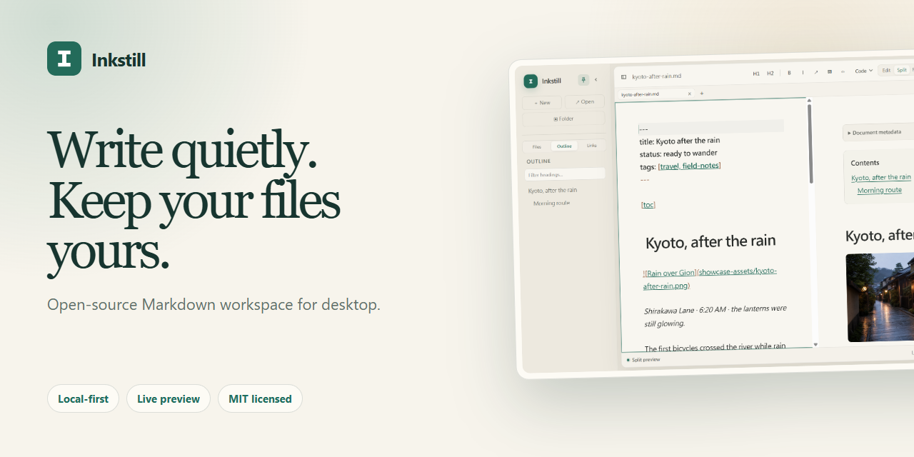

<p align="center">
  
</p>

<h1 align="center">Inkstill</h1>

<p align="center"><strong>Write quietly. Keep your files yours.</strong></p>

<p align="center">
  A calm, local-first Markdown workspace for Windows, macOS, and Linux.<br>
  Beautiful writing, connected notes, and ordinary Markdown files—without an account.
</p>

<p align="center">
  <sub>LANGUAGE</sub><br>
  <a href="README.md"><strong>English</strong></a> ·
  <a href="README.zh-CN.md">简体中文</a> ·
  <a href="https://scotteliu.github.io/Inkstill/zh-tw.html">繁體中文</a> ·
  <a href="https://scotteliu.github.io/Inkstill/es.html">Español</a><br>
  <a href="https://scotteliu.github.io/Inkstill/pt-br.html">Português</a> ·
  <a href="https://scotteliu.github.io/Inkstill/hi.html">हिन्दी</a> ·
  <a href="https://scotteliu.github.io/Inkstill/ru.html">Русский</a> ·
  <a href="https://scotteliu.github.io/Inkstill/de.html">Deutsch</a>
</p>

<p align="center">
  <a href="https://github.com/ScotteLiu/Inkstill/actions/workflows/windows-candidate.yml"></a>
  <a href="https://github.com/ScotteLiu/Inkstill/actions/workflows/cross-platform-candidate.yml"></a>
  <a href="LICENSE"></a>
  <a href="https://github.com/ScotteLiu/Inkstill/releases"></a>
</p>

<p align="center">
  <a href="https://github.com/ScotteLiu/Inkstill/releases/download/v1.1.3-preview.1/Inkstill-1.1.3.Setup.exe"></a>
</p>



## A writing space that stays out of your way

Inkstill keeps Markdown readable while you type, then gives you a polished preview
when you want it. Open a file and write, or open a folder and turn a collection of
notes into a navigable workspace.

| Focused writing | Connected notes | Your files |
| --- | --- | --- |
| Edit, Split, and Read views with focus and typewriter modes. | Outline, full-text search, Wiki links, backlinks, and unlinked mentions. | Standard Markdown on disk, portable image paths, no required cloud account. |

## See it in action


<table>
  <tr>
    <td width="50%">
      
      <br><strong>Everything a shortcut away</strong><br>
      Search commands, formatting, views, exports, and workspace actions from one keyboard-first palette.
    </td>
    <td width="50%">
      
      <br><strong>Shape the space around your words</strong><br>
      Choose a theme and reading width, then enable focus, typewriter, Hemingway, spellcheck, or a writing goal.
    </td>
  </tr>
</table>

## Highlights

- Rich, source-faithful Markdown with GFM tables and tasks, footnotes, highlighted
  code, KaTeX math, Mermaid diagrams, Wiki links, table of contents, YAML metadata,
  alerts, emoji, and sub/superscript.
- Multiple tabs, last-session restoration, per-document recovery journals, external
  change warnings, and explicit conflict review.
- Folder workspaces with file navigation, full-text search, quick open, searchable
  outline, backlinks, and unlinked mentions.
- Command palette, graphical Table Builder, Markdown cheat sheet, find and replace,
  bracket pairing, indentation tools, and keyboard-first formatting.
- Light, dark, and system themes; focus, typewriter, and Hemingway modes; spellcheck,
  line numbers, reading time, selection statistics, and word goals.
- Local image import and clipboard image paste, plus Copy as HTML and standalone
  HTML/PDF export.

## Download

Direct downloads:

- [Windows x64 installer](https://github.com/ScotteLiu/Inkstill/releases/download/v1.1.3-preview.1/Inkstill-1.1.3.Setup.exe)
- [Portable Windows x64 ZIP](https://github.com/ScotteLiu/Inkstill/releases/download/v1.1.3-preview.1/Inkstill-win32-x64-1.1.3.zip) — extract and run `Inkstill.exe`.
- [SHA-256 checksums](https://github.com/ScotteLiu/Inkstill/releases/download/v1.1.3-preview.1/SHA256SUMS.txt)

macOS (Intel and Apple silicon) and Linux x64 packages are now built and tested by
the cross-platform candidate pipeline. They will become direct Release downloads
with the next preview after native validation. See [platform support](docs/PLATFORM_SUPPORT.md).

> **Preview notice:** Current binaries are not yet Authenticode-signed, so Windows
> may show a SmartScreen warning. Source, locked dependencies, SBOM, third-party
> licenses, build manifest, and checksums are published for inspection.

## File safety, privacy, and performance

- The editor runs in a sandboxed renderer with context isolation, restrictive CSP,
  secure Electron fuses, and narrow typed IPC.
- Markdown stays in files you choose and local recovery data. Inkstill has no
  required account, telemetry service, or document upload path.
- Saves and recovery writes are serialized; external modifications are never
  silently overwritten.
- UTF-8 BOM and LF/CRLF are preserved, with an explicit choice for mixed line endings.
- Large-file safeguards and bounded workspace caches prevent expensive background
  work from growing without limits.
- Runtime budgets continuously check startup, idle CPU, memory, process count, and
  package size. See [Performance policy](docs/PERFORMANCE.md).

## Build from source

Use Node 24.14.0 and pnpm 11.9.0:

```sh
pnpm install --frozen-lockfile
pnpm start
```

Run all source, security, packaged-app, and runtime checks:

```sh
pnpm verify
```

See [CONTRIBUTING.md](CONTRIBUTING.md) before contributing. Report security issues
privately according to [SECURITY.md](SECURITY.md), not in a public issue.

## Current scope

Inkstill supports Windows x64, macOS Intel/Apple silicon, and Linux x64 at the
source and native-package candidate level. The current public Release remains
Windows-only while unsigned macOS/Linux candidates complete hardware validation.
Cloud sync, real-time collaboration, hosted publishing, and online AI accounts
are not represented as features of this local editor.

## License and contributors

Inkstill is open source under the [MIT License](LICENSE).

Copyright © 2026 Scotte Liu.

- **Scotte Liu** — Creator, copyright holder, and lead developer
- **[OpenAI Codex](https://github.com/codex)** — Primary AI development contributor
- **Anthropic Claude** — Additional AI review contributor

See the full [contributors list](CONTRIBUTORS.md) for contribution details.
