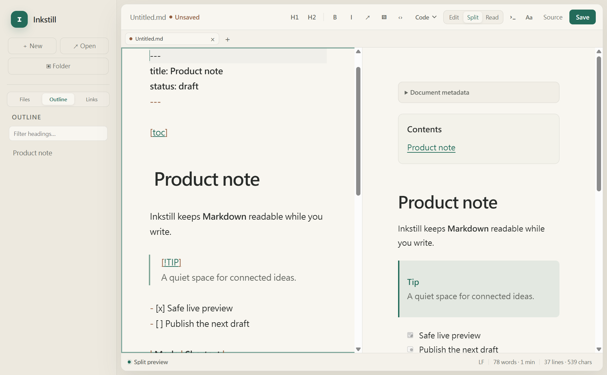
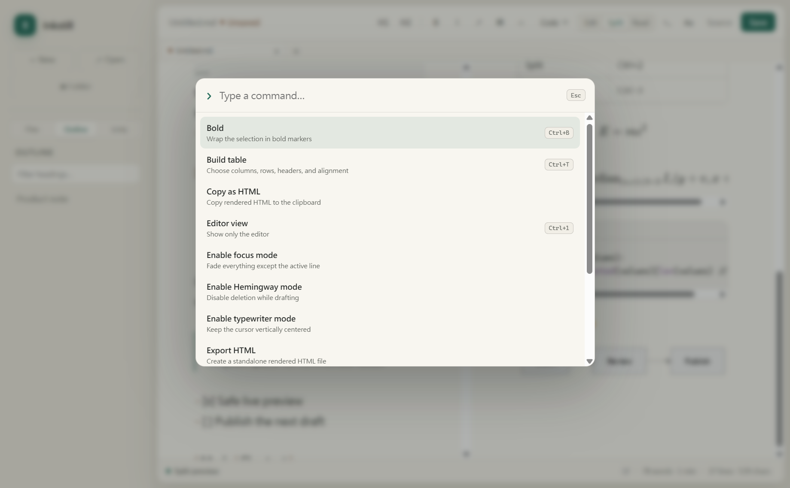
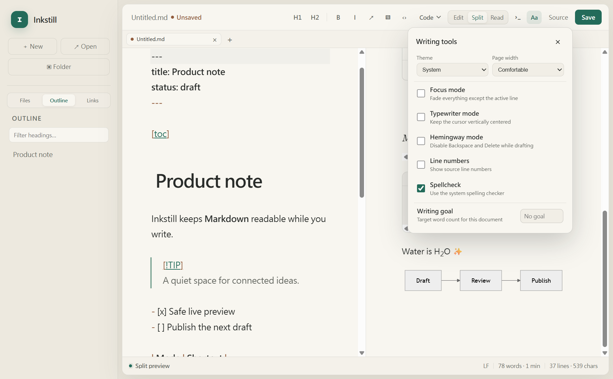

<p align="center">
  
</p>

<h1 align="center">Inkstill</h1>

<p align="center"><strong>安静写作，文件始终属于你。</strong></p>

<p align="center">
  一款面向 Windows、macOS 与 Linux、以本地文件为核心的 Markdown 工作空间。<br>
  无需账号，即可获得优雅写作、知识连接与标准 Markdown 文件。
</p>

<p align="center">
  <a href="README.md">English</a> · <a href="README.zh-CN.md">简体中文</a>
</p>

<p align="center">
  <a href="https://github.com/ScotteLiu/Inkstill/actions/workflows/windows-candidate.yml"></a>
  <a href="https://github.com/ScotteLiu/Inkstill/actions/workflows/cross-platform-candidate.yml"></a>
  <a href="LICENSE"></a>
  <a href="https://github.com/ScotteLiu/Inkstill/releases"></a>
</p>

<p align="center">
  <a href="https://github.com/ScotteLiu/Inkstill/releases/download/v1.1.2-preview.1/Inkstill-1.1.2.Setup.exe"></a>
</p>



## 不打扰思绪的写作空间

Inkstill 在输入时保持 Markdown 清晰可读，需要时再呈现精致预览。你可以直接
打开一个文件开始写作，也可以打开整个文件夹，将笔记整理成可浏览、可搜索、
彼此连接的知识空间。

| 专注写作 | 连接笔记 | 文件自主 |
| --- | --- | --- |
| 编辑、分屏与阅读视图，并提供专注和打字机模式。 | 大纲、全文搜索、Wiki 链接、反向链接与未链接提及。 | 使用磁盘中的标准 Markdown 与可移植图片路径，无需云端账号。 |

## 看看它如何工作

<table>
  <tr>
    <td width="50%">
      
      <br><strong>所有操作，触手可及</strong><br>
      在键盘优先的命令面板中搜索格式、视图、导出与工作空间操作。
    </td>
    <td width="50%">
      
      <br><strong>让空间适应你的文字</strong><br>
      选择主题与阅读宽度，并启用专注、打字机、Hemingway、拼写检查或写作目标。
    </td>
  </tr>
</table>

## 功能亮点

- 忠于源码的丰富 Markdown：支持 GFM 表格与任务、脚注、代码高亮、KaTeX
  数学公式、Mermaid 图表、Wiki 链接、目录、YAML 元数据、提示块、Emoji
  和上下标。
- 多标签页、上次会话恢复、每个文档独立的恢复日志、外部修改提醒与明确的
  冲突检查。
- 文件夹工作空间、文件浏览、全文搜索、快速打开、可搜索大纲、反向链接与
  未链接提及。
- 命令面板、可视化表格生成器、Markdown 速查表、查找替换、括号配对、
  缩进工具和键盘优先的格式操作。
- 亮色、深色与系统主题；专注、打字机与 Hemingway 模式；拼写检查、行号、
  阅读时间、选区统计和字数目标。
- 本地图片导入、剪贴板图片粘贴、复制 HTML，以及独立的 HTML/PDF 导出。

## 下载

直接下载：

- [Windows x64 安装版](https://github.com/ScotteLiu/Inkstill/releases/download/v1.1.2-preview.1/Inkstill-1.1.2.Setup.exe)
- [Windows x64 免安装 ZIP](https://github.com/ScotteLiu/Inkstill/releases/download/v1.1.2-preview.1/Inkstill-win32-x64-1.1.2.zip)：解压后运行 `Inkstill.exe`。
- [SHA-256 校验码](https://github.com/ScotteLiu/Inkstill/releases/download/v1.1.2-preview.1/SHA256SUMS.txt)

macOS（Intel 与 Apple 芯片）和 Linux x64 安装包现已进入跨平台候选构建与
测试流程。完成原生硬件验证后，它们会随下一预览版提供 Release 直接下载。
详见[平台支持说明](docs/PLATFORM_SUPPORT.md)。

> **预览版说明：** 当前程序尚未使用 Authenticode 签名，因此 Windows
> 可能显示 SmartScreen 提示。源代码、锁定依赖、SBOM、第三方许可证、
> 构建清单和校验码均公开供检查。

## 文件安全、隐私与性能

- 编辑器运行在沙箱 renderer 中，并启用 context isolation、严格 CSP、
  安全 Electron fuses 和范围受限的类型化 IPC。
- Markdown 只保存在你选择的文件与本地恢复数据中。Inkstill 不要求账号，
  不包含遥测服务，也没有上传文档的程序路径。
- 保存与恢复写入采用串行处理；外部修改不会被静默覆盖。
- 保留 UTF-8 BOM 与 LF/CRLF，混合换行必须由用户明确选择。
- 大文件保护和有明确上限的工作空间缓存，可避免后台工作无限增长。
- 自动性能门槛持续检查启动速度、空闲 CPU、内存、进程数与程序体积。
  详见[性能策略](docs/PERFORMANCE.md)。

## 从源码构建

使用 Node 24.14.0 与 pnpm 11.9.0：

```sh
pnpm install --frozen-lockfile
pnpm start
```

执行源码、安全、打包程序与运行时完整验证：

```sh
pnpm verify
```

参与贡献前请阅读 [CONTRIBUTING.md](CONTRIBUTING.md)。安全问题请按照
[SECURITY.md](SECURITY.md) 私下报告，不要创建公开 Issue。

## 当前范围

Inkstill 已在源码和原生候选安装包层面支持 Windows x64、macOS Intel /
Apple 芯片与 Linux x64。当前公开 Release 仍仅提供 Windows 版，未签名的
macOS/Linux 候选版正在完成硬件验证。云同步、实时协作、托管发布和在线
AI 账号并不是这款本地编辑器所宣称的功能。

## 许可证与致谢

Inkstill 使用 [MIT License](LICENSE) 开源。

Copyright © 2026 Scotte Liu.

- **Scotte Liu**：创作者、著作权人及主要开发者
- **OpenAI Codex**：开发协助
